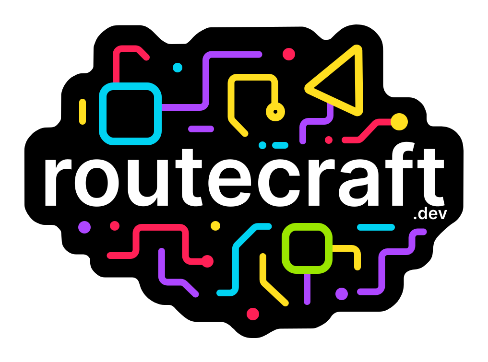

<div align="center">

  

  <p><strong>Give AI access, not control</strong></p>

  <a href="https://github.com/routecraftjs/routecraft/actions/workflows/ci.yml"></a>
  
  
  <a href="./LICENSE"></a>
  <a href="https://github.com/routecraftjs/routecraft/issues"></a>
  <a href="https://github.com/routecraftjs/routecraft/pulls"></a>

</div>

## About

Routecraft is a code-first automation platform for TypeScript. Write routes that send emails, manage calendars, and automate work. AI calls your code, not your computer.

## Why Routecraft?

- ✅ **AI that does real work** - Send emails, schedule meetings, automate tasks
- ✅ **Code, not configs** - TypeScript all the way with full IDE support
- ✅ **Works with Claude & Cursor** - Expose tools via MCP automatically
- ✅ **You stay in control** - AI only accesses the routes you code

## Quick Start

### Write a tool

```ts
import { mcp } from '@routecraft/ai'
import { craft, mail } from '@routecraft/routecraft'
import { z } from 'zod'

// Define a tool AI can call
export default craft()
  .from(mcp('send-team-email', {
    description: 'Send email to team members',
    schema: z.object({ 
      to: z.string().email().refine(
        email => email.endsWith('@company.com'),
        'Can only send to @company.com addresses'
      ),
      subject: z.string(),
      message: z.string()
    })
  }))
  .to(mail())  // Config loaded from context
```

### Expose to Claude Desktop

Add to `~/Library/Application Support/Claude/claude_desktop_config.json`:

```json
{
  "mcpServers": {
    "my-tools": {
      "command": "npx",
      "args": ["@routecraft/cli", "run", "./routes/tools.mjs"]
    }
  }
}
```

Now talk to Claude: *"Send an email to john@example.com thanking him for yesterday's meeting"*

Claude discovers your tool and uses it automatically. ✨

📚 [Get Started](https://routecraft.dev/docs/introduction) | [AI Examples](https://routecraft.dev/docs/examples/ai-email-parser) | [API Docs](https://routecraft.dev/docs/reference)

## Key Features

- **Make AI useful** - Send emails, schedule meetings, automate tasks
- **Code-first** - TypeScript with full IDE support, testing, and version control
- **MCP native** - Works with Claude Desktop, Cursor, and any MCP client
- **Type-safe** - Zod-powered validation ensures data integrity
- **Deploy anywhere** - Run locally, self-host, or use our upcoming cloud platform

## Monorepo Structure

- `packages/routecraft` – Core library (builder, DSL, context, adapters, consumers)
- `packages/ai` – AI and MCP integrations (`mcp()`, schema validation, discovery)
- `packages/cli` – CLI to run files or folders of routes and start contexts
- `apps/routecraft.dev` – Documentation site (docs, examples, guides)
- `examples/` – Runnable example routes and tests

## Examples

**Real-world automation:**
- **Email Assistant** - [Send and manage emails](https://routecraft.dev/docs/examples/ai-email-parser)
- **Calendar & Meetings** - [Schedule meetings automatically](https://routecraft.dev/docs/examples/ai-agent-tools)
- **Travel & Booking** - [Search flights and book restaurants](https://routecraft.dev/docs/examples/ai-document-processor)

Try it yourself: `pnpm craft run ./examples/mcp-echo.mjs`

## Contributing

Contributions are welcome! Please read our contribution guide at https://routecraft.dev/docs/community/contribution-guide for guidelines on how to propose changes, add adapters, and write routes.

## License

Licensed under the [Apache 2.0 License](./LICENSE).
