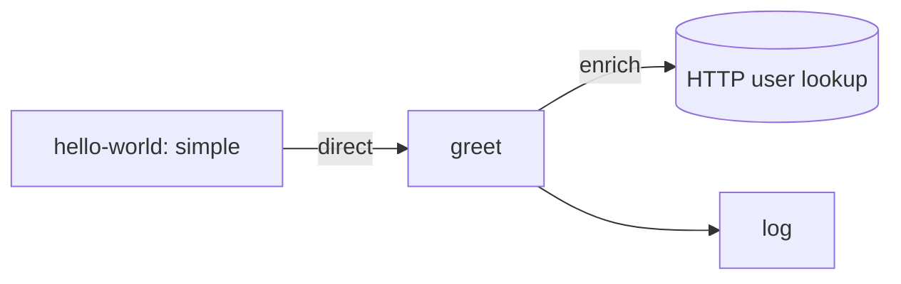

# hello-world

Two capabilities that demonstrate the core shape of Routecraft: a caller dispatching to a
service by id.

- `greet` receives a user id over the `direct()` endpoint, enriches it with an HTTP lookup,
  and returns a greeting.
- `hello-world` is the caller: it emits a user id and dispatches to `greet`.

`route.ts` is the public surface: it default-exports the routes and is the only file other
capabilities may import. `craft start` discovers this folder on its own, so nothing
registers it by hand.

`greet` calls `https://jsonplaceholder.typicode.com`, so the first run needs a network. The
tests do not: they replace `fetch`, which is also the shape to copy when you write your own.

Run the project with `bun run start`, and the tests with `bun run test`.
