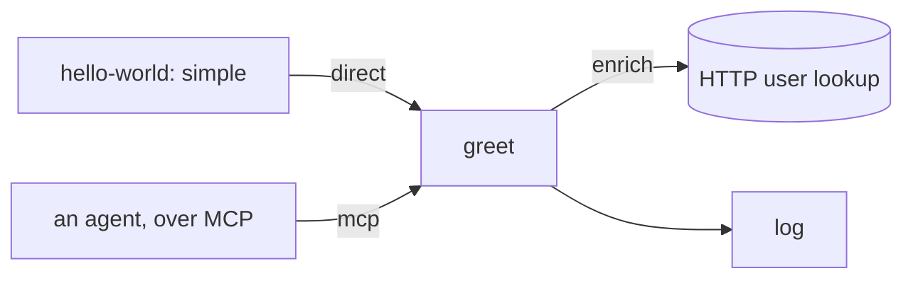

# hello-world

Two routes that show the shape of a Routecraft project: a capability behind two doors, and a
caller that uses one of them.

- `greet` receives a user id, enriches it with an HTTP lookup, and returns a greeting. It
  stands behind `direct()`, the in-process door, and `mcp()`, which makes it a tool an agent
  can call. The input schema is validated whichever door the call came through.
- `hello-world` is the caller: it emits a user id at start and dispatches to `greet`.

```mermaid
flowchart LR
  A[hello-world: simple] -->|direct| B[greet]
  M[an agent, over MCP] -->|mcp| B
  B -->|enrich| C[(HTTP user lookup)]
  B --> D[log]
```

`route.ts` is the public surface: it default-exports the routes and is the only file other
capabilities may import. `craft start` discovers this folder on its own, so nothing
registers it by hand.

`greet` calls `https://jsonplaceholder.typicode.com`, so the first run needs a network. The
test does not: it stands `mockAdapter(http, ...)` in for the lookup and `mockAdapter(mcp, ...)`
in for the MCP source, so no request leaves the machine, no MCP transport starts, and the test
stays about what the capability does. That is the shape to copy when you write your own.

Run the project with `bun run start`, the tests with `bun run test`, and see the project
README for connecting an agent.
