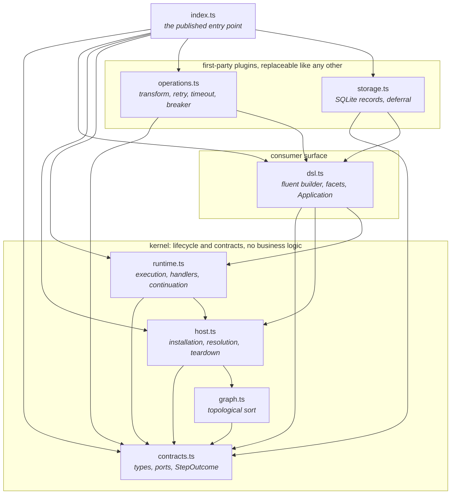
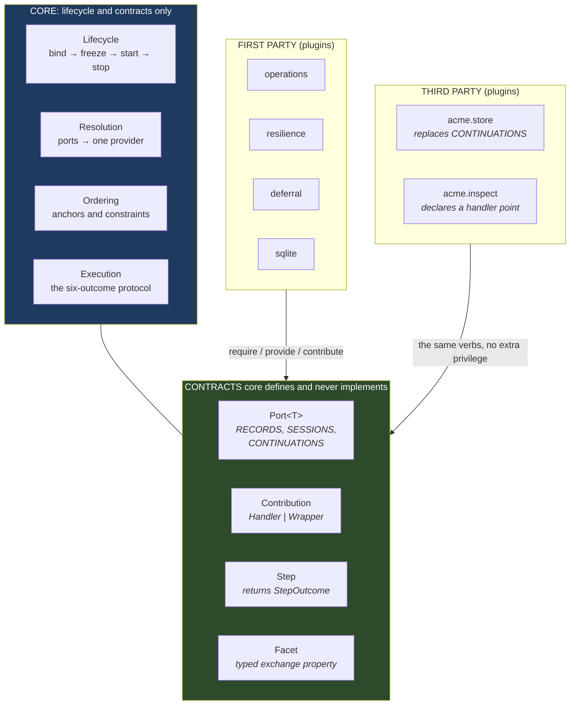
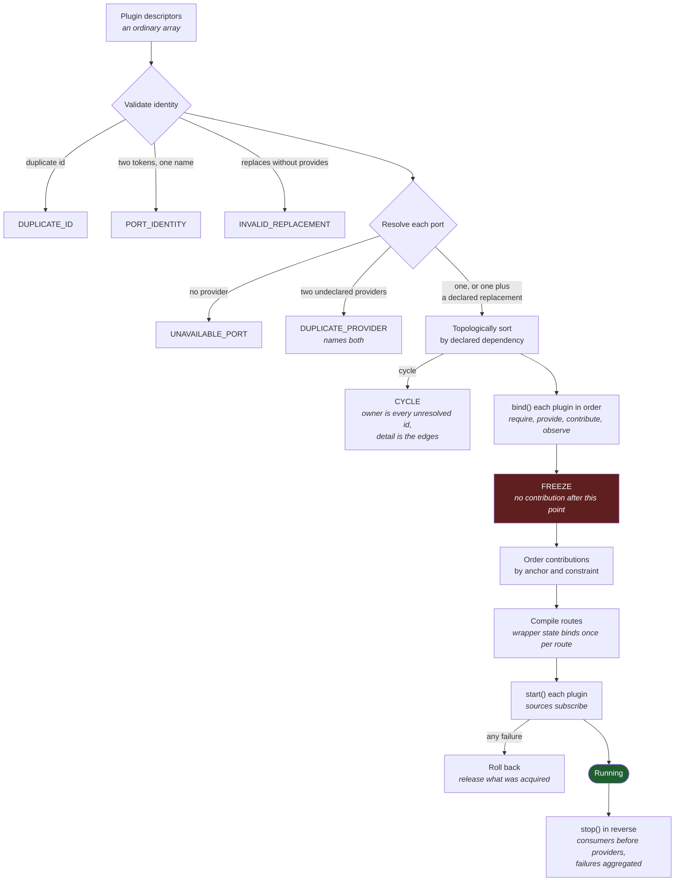
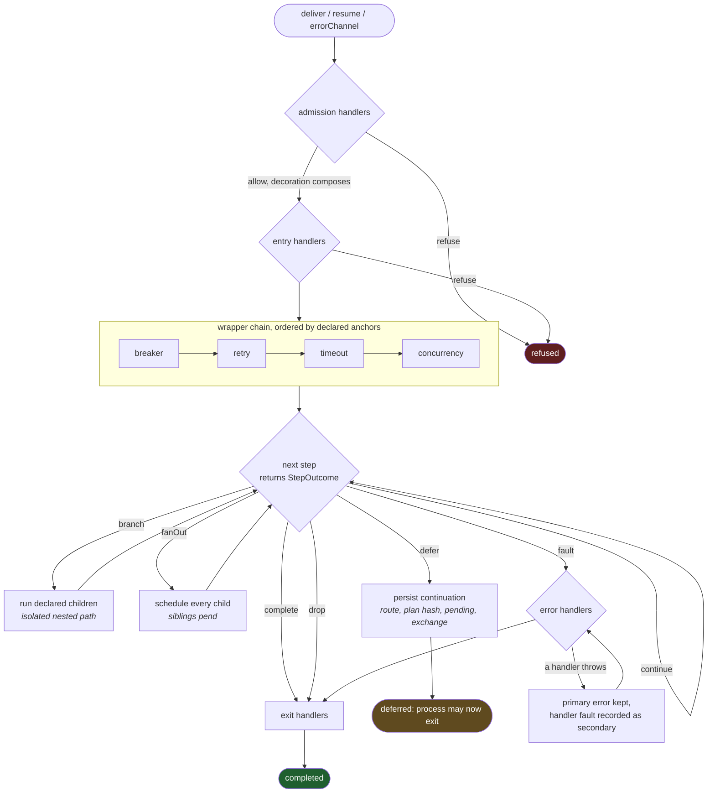
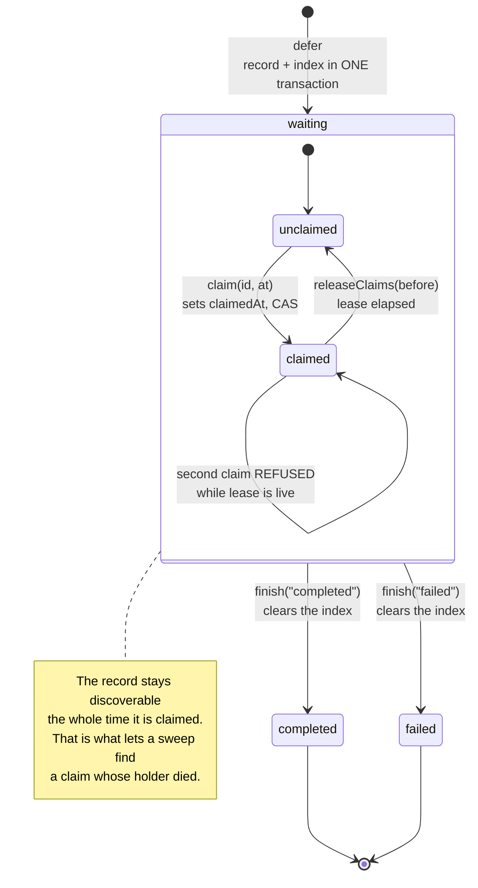

# The mechanism, one level down

Read `DIAGRAMS.md` first. That file has the idea; this one has how it runs.

These are drawn from the code rather than the prose, and `bun run verify:diagram`
re-derives the module graph from the AST and fails if this file and `src/v2/`
disagree. They therefore look like reality, because they are.

`ARCHITECTURE.md` remains the source of truth.

Mermaid renders inline on GitHub. Nothing here needs a toolchain.

---

## 1. Modules and the enforced dependency graph

The layering exists so that editors who come and go cannot quietly couple two
things. Every edge below is permitted by `validation/round-two/boundaries.ts`;
every edge not drawn is a build failure. The gate is closed over the directory,
walks dynamic `import()` as well as top-level statements, and refuses a computed
specifier, so a new file cannot sit outside it.

Read the absent edges. `contracts.ts` imports nothing, so a contract can never
reach an implementation. `host.ts` cannot see `runtime.ts`, so installation does
not know how an exchange runs. Neither `operations.ts` nor `storage.ts` is
visible to anything in the kernel, which is the mechanical form of the claim
that first-party capabilities hold no privilege.

---

## 2. What core owns, and what a plugin reaches it through

Core is lifecycle management and contracts. It has no opinion about retries,
storage, agents or HTTP. A plugin never names another plugin: it names a **port**
and the host resolves a provider, which is why a stranger can replace a
first-party provider under its own identity.

The two lower boxes reach the middle one by identical arrows on purpose. That
equality is the whole design claim, and it is tested by building a plugin
against a packed tarball rather than against workspace source.

---

## 3. Installation: descriptors to a running application

Everything that can fail names the plugin responsible, and everything that can
be contributed must be contributed before the chain is composed. `freeze` is the
line: a contribution arriving from `start()` would silently miss an already
composed chain, so it is refused instead.

The same topological sort orders plugins by dependency and contributions by
constraint. They are the same problem, and solving them once is the evidence
that core understands dependency rather than capability.

---

## 4. One exchange through a route

The step loop is the protocol round one discarded and round five restored. Six
outcomes, not a `void` return, which is what makes halting, branching and
deferring expressible by a plugin rather than only by the framework.

A handler declares which run kinds it survives, so a policy can apply on first
delivery and deliberately not re-apply on a resumed continuation. A wrapper does
the same: the breaker does not re-arm on `resume`, and nothing in the chain runs
on `errorChannel`.

Two things are worth noticing because they were defects before they were
features. The chain order is declared, not positional, so a stranger can land
between `retry` and `timeout` without a core change. And wrapper state binds
once per compiled route, so a concurrency limit is a property of the route
rather than of one delivery.

---

## 5. A deferred continuation, including the crash path

This is the diagram round six changed. A claim is a **second axis** over a record
that stays `waiting`, never a transition out of it. Round five modelled it as a
state change that also deleted the waiting index, which meant a process dying
mid-resume stranded the continuation forever. The shipped framework already
heals this with a lease, so the spike now does too.

The crash path in sequence, which is what the process test actually executes:

```mermaid
sequenceDiagram
    participant P1 as Process 1
    participant S as Store (SQLite)
    participant P2 as Process 2

    P1->>S: defer: record + waiting index (one transaction)
    Note over P1: effects so far: prefix, tool-request
    P1-xP1: SIGKILL
    Note over S: record: waiting, unclaimed
    P2->>S: resume("approval")
    P2->>S: plan hash check
    Note over P2: a changed plan is rejected<br/>BEFORE the claim is consumed
    P2->>S: claim → claimedAt set, still waiting
    P2->>P2: run the SUFFIX only<br/>prefix is not repeated
    P2->>S: finish("completed"), index cleared
    Note over P2: effects now: prefix, tool-request,<br/>tool-result, suffix

    rect rgb(95, 74, 31)
        Note over P2,S: if Process 2 also dies here,<br/>releaseClaims hands the record back<br/>once the lease elapses
    end
```

What this does **not** claim, checked against the shipped framework rather than
asserted: external effects are at-least-once, not exactly-once; the session and
deferral stores are not in one distributed transaction; and a timeout cannot
retract IO from a plugin that ignores cancellation. All three are limits the
current framework also has and documents.

---

## Where to look in the code

| Diagram | Code |
|---|---|
| 1 | `validation/round-two/boundaries.ts` is the allowlist, executable |
| 2 | `src/v2/contracts.ts` for ports and contributions, `Installation` for the verbs |
| 3 | `src/v2/host.ts` constructor and `start`, `src/v2/graph.ts` |
| 4 | `src/v2/runtime.ts`, the outcome switch and the handler loop |
| 5 | `src/v2/storage.ts` `durableStore`, `test/round-two/process.test.ts` |
