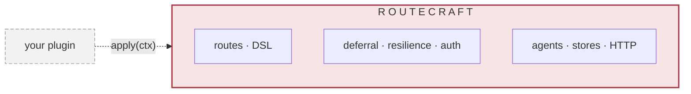
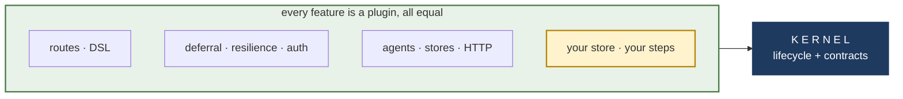
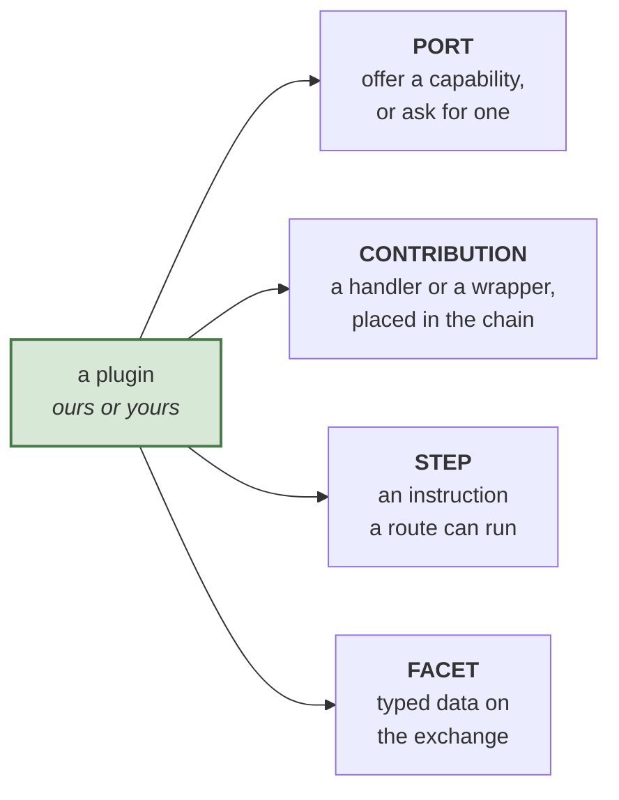

# What changes, in two pictures

The whole redesign is one move: **the framework stops being a block that our
features live inside, and becomes a small kernel that every feature plugs into
from outside, ours and yours through the same holes.**

Everything else in this folder is a consequence of that sentence. If the two
pictures below land, the rest is detail you can take later.

---

## Today

Our features are **inside**. They do not ask permission and they do not go
through a door, because there is no door between a thing and itself. Deferral
reaches the step executor directly. The filter chain order is fixed and owned by
the framework. Resilience knows where the route lives.

A plugin is **outside**, and gets handed the entire context with one verb,
`apply`. It can reach whatever it happens to find. What it cannot do is any of
what our features do, because those paths are private. Even `dependsOn` exists
on the interface today and is documented as reserved and not enforced.

So the asymmetry is not a matter of degree. It is structural: we are in the
room and you are at the window.

---

## After

The kernel keeps only two jobs: **run the lifecycle** (install, order, start,
stop) and **define the contracts**. It has no opinion about retries, storage,
agents or HTTP, and it cannot reach them.

Everything else moves outside, including everything we ship. The two arrows are
drawn identically because they are identical: our deferral plugin and your
deferral plugin use the same verbs and get the same access. That is the claim
the whole spike exists to test, and the test is building a plugin against a
published tarball rather than against our source.

---

## The only new thing to learn: four sockets

A plugin does exactly four things. Not forty.

- **Port.** A named capability, not a named plugin. You ask for "a place to
  store continuations", not for "our SQLite plugin". That is what lets a
  stranger replace a first-party provider under their own name.
- **Contribution.** A handler runs at a point (admission, entry, error, exit)
  and may decorate; at admission and entry it may refuse. A wrapper surrounds
  the route, like retry or timeout. Both say where they sit by naming anchors,
  not numbers, and both say which run kinds they apply to.
- **Step.** An instruction inside a route. It returns an outcome rather than
  nothing, which is how a plugin gets to halt, branch or defer instead of only
  the framework being able to.
- **Facet.** Typed data your plugin hangs on the exchange under its own name
  (`ex.deferral`, `ex.auth`), which the route's `.transform((body, ex) => ...)`
  sees with real types, and which is a compile error when the plugin is not
  installed.

---

## What that buys, in one table

| | Today | After |
|---|---|---|
| Our features | inside, privileged | plugins, like any other |
| Your features | one verb, reach in and hope | the same four sockets we use |
| Depending on something | `dependsOn` is declared and ignored | a port, resolved to a provider, enforced |
| Replacing something of ours | not possible | install yours, declare the replacement |
| Chain position | framework picks, fixed list | you name an anchor and land in it |
| A failure at boot | wherever it surfaces | names the plugin responsible |

---

## Going deeper

Only when you want it. `DIAGRAMS-MECHANISM.md` has five diagrams of how this
actually runs: the enforced module graph, installation from descriptors to a
running application, one exchange through a route, and the durable continuation
including the crash path. Those are drawn from the code and checked against it,
which is why they look like reality rather than like an idea.
