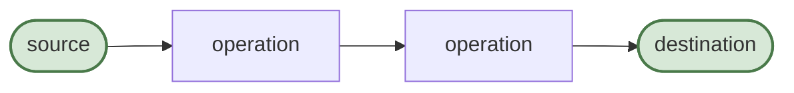
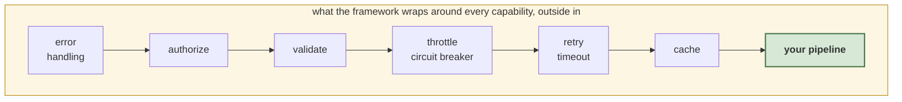
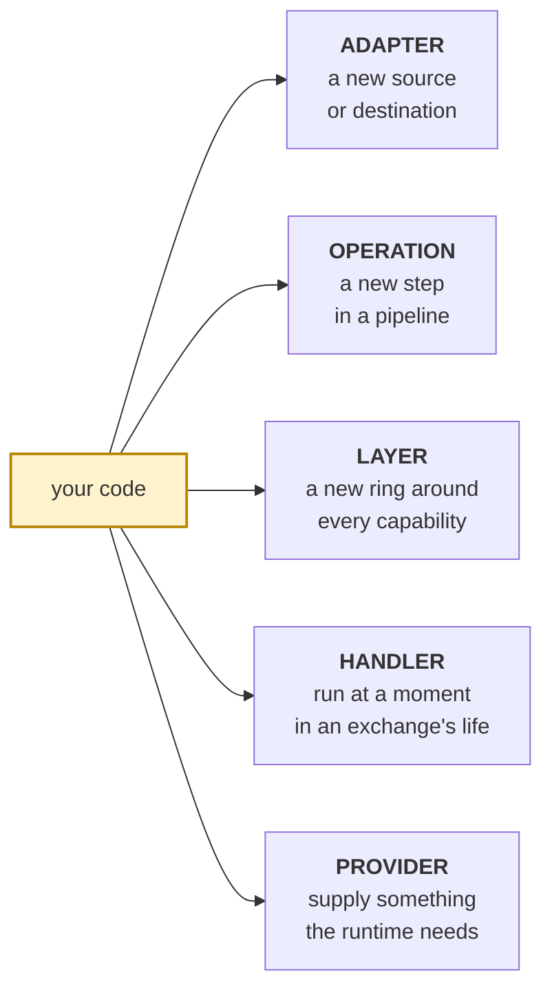
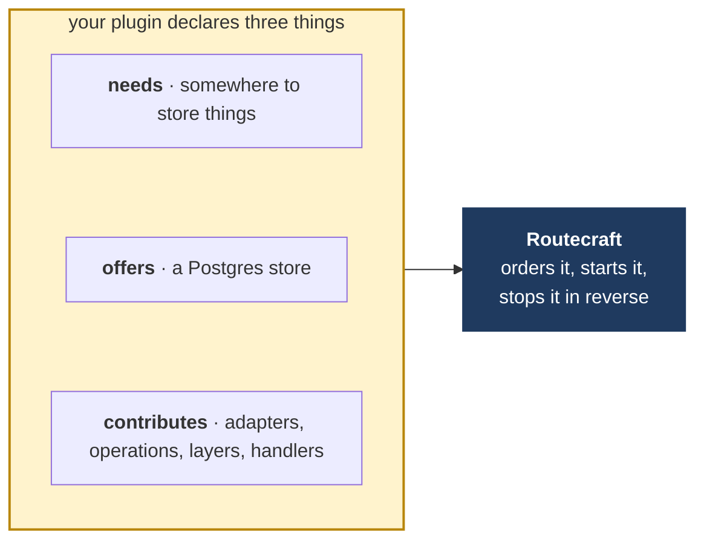
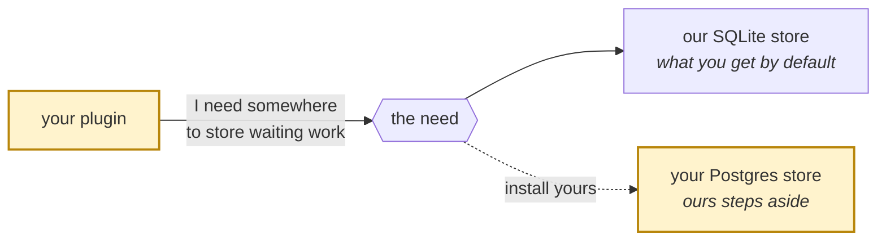
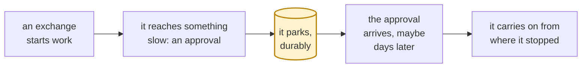

# How Routecraft works, and where your code goes

**Draft of the public architecture page.** This is written for someone who
already builds capabilities and now wants to extend the framework itself. It
uses only vocabulary the docs site already uses: capability, exchange, source,
destination, operation, adapter, plugin.

**It describes the 0.8 architecture, which does not exist yet.** Today plugins
are second class and most of what follows is not true. This is the page we would
publish alongside that release, drafted now because the concepts have to be
explainable before they are worth shipping. Nothing here is generated from code.

---

## 1. A capability is a pipeline

A source produces something. Operations do work to it. A destination sends it
somewhere. That is the whole shape, and it is what `craft().from().to()` builds.

The thing travelling along the arrows is an **exchange**: a body, some headers,
and who the work is being done for. Every operation receives one and hands one
on. Nothing else moves between the boxes.

---

## 2. The framework wraps your pipeline in layers you did not write

When you call `.retry()` or `.authorize()`, you are not inserting a step into
your pipeline. You are configuring a layer that already surrounds it. (The
layers drawn are today's chain. The proof of concept has four of them, under
one resilience contract; the rest are feature-fit work.)

This is why the order you call them in does not matter. Authorization always
happens before validation, retry always happens inside the timeout, and caching
is always closest to your code. The framework owns that order so that every
capability behaves the same way, and so that reading one tells you how all of
them work.

The layers are the part most people never think about until they want to add
one. That is the next diagram.

---

## 3. The five places your code can go

- **Adapter.** Connect a system Routecraft does not know about. Yours goes in
  `.from()` and `.to()` exactly like the ones we ship.
- **Operation.** A step someone can put in their pipeline, like `.transform()`
  or `.delay()`. Yours appears on the builder with the same typing.
- **Layer.** A ring in the previous diagram. You say which existing layers you
  sit inside and outside of, by name, and you land there. You do not pick a
  number and hope.
- **Handler.** Code that runs at a named moment: when an exchange is admitted,
  when it enters, when it fails, when it finishes. At admission and entry a
  handler can refuse the exchange; at every moment it can add to it. Each
  moment says which decisions it honours.
- **Provider.** The runtime needs a few things to do its job, such as somewhere
  to keep exchanges that are waiting. You can be the one who supplies it.

Everything a plugin names lives under its own name: its data on the exchange
is `ex.yourplugin.whatever`, its route options are `yourplugin.whatever`, and
its layers and handlers are yours even if another plugin picked the same word.
Two plugins cannot collide on a string, and the compiler tells you when you use
one that is not installed.

A route that asks for something only a plugin can give, such as
`.authorize("approve")`, cannot ask without that plugin installed: the method
is not there to call, and if it somehow were, the route would refuse to start.
An ask never fails open.

**Everything Routecraft ships is built from these five.** Retry is a layer.
`.transform()` is an operation. Deferral's store is a provider and `.defer()` is
an operation. There is no sixth kind that only we are allowed to use. If
something we ship can do it, so can you.

One honest exception, stated rather than hidden: the runtime itself owns how a
parked exchange is claimed, checked and resumed. You can replace where it is
stored and what parks it; you cannot change the protocol that resumes it. That
is the kernel's job, and it is small.

---

## 4. A plugin is how you deliver those

A plugin is a plain object that declares what it **needs** and what it
**offers**, and a `bind` function in which it **contributes** adapters,
operations, layers and handlers. You never wire it up yourself and you never
decide when it starts.

Routecraft reads those declarations, works out an order that satisfies them,
starts everything in that order and stops it in reverse. If two plugins need
each other, or something is missing, you are told at startup, by name, before
any traffic runs.

---

## 5. You depend on a capability, never on a package

This is the idea that makes the rest work, and it is worth slowing down for.

Your plugin says **"I need somewhere to store waiting work"**. It does not say
"I need the SQLite plugin". So when someone installs a Postgres store instead,
your plugin keeps working and never learns that anything changed.

It also means ours is not special. Our SQLite store is the default because it is
installed by default, not because the framework knows its name. Install yours
and declare that it replaces ours, and yours is the one everyone gets. (Ours
still starts up unless you leave it out; it just stops being chosen.)

---

## 6. An exchange can wait, and waiting survives a restart

Between parking and carrying on, the process can stop, be redeployed, or crash.
The exchange is not in memory; it is in a store, which is one of the things a
provider supplies.

When it carries on, it carries on **from where it stopped**. The steps before
the wait do not run again, and the same approval presented twice is answered
from the first time rather than run twice. Who is allowed to carry it on is
decided when the approval arrives, from the identity that arrives with it,
never from who parked it.

One thing this deliberately does not promise: if the process dies in the middle
of carrying on, the work is not silently retried. It is reported, because the
steps after the wait may have half happened, and re-running a payment is worse
than asking a human. This is what makes a capability that waits for a human
different from a capability that blocks a thread for three days.

---

## 7. Some things run again on a resume, and some must not

A layer or a handler says which kinds of run it applies to: a first delivery, a
resume after a wait, a debounced release, a delivery to the error channel. A
retry applies on a resume; a circuit breaker does not re-arm on one; an
authorisation check applies on every kind, because the resume brings its own
identity. Getting this wrong has security consequences, so every layer and
handler declares it rather than inheriting a default.

---

## Where to go next

| You want to | Read |
|---|---|
| Connect a system we do not support | Adapters |
| Add a step others can use in a pipeline | Operations |
| Add behaviour around every capability | Layers and handlers, and what runs again |
| Replace something we ship | Providers |
| Package any of the above | Plugins |
