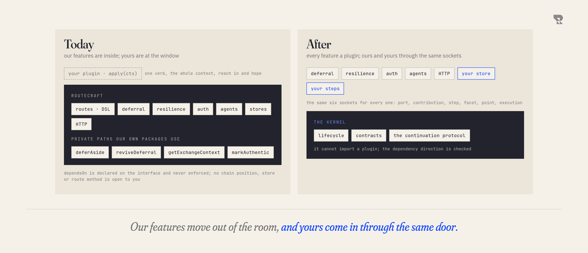
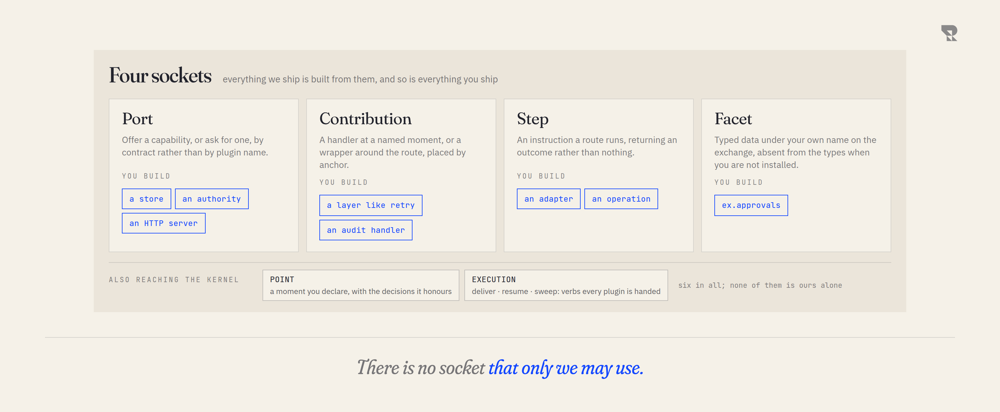

# What changes

The whole redesign is one move. **The framework stops being a block that our
features live inside, and becomes a small kernel that every feature plugs into
from outside, ours and yours through the same holes.**

Everything else in this folder is a consequence of that sentence.

From outside, the move is invisible. The picture below is Routecraft as a
consumer meets it: every way in, a harness on your laptop and one for the
team, and the systems they reach with your credentials or the team's. None
of that changes. What changes is the band in the middle, inside every
harness, and every page after this one opens that band up.

<picture>
  <source media="(prefers-color-scheme: dark)" srcset="figures/every-way-in-dark.png">
  
</picture>

<picture>
  <source media="(prefers-color-scheme: dark)" srcset="figures/today-and-after-dark.png">
  
</picture>

## Today

Our features are inside. Deferral reaches the step executor directly. The
filter chain is a fixed list the framework owns, and a plugin cannot add a
position to it. Resilience knows where the route lives. Identity is a getter
on the exchange class.

A plugin is outside. It gets the whole context through one verb, `apply`, and
can reach whatever it happens to find there. What it cannot do is any of what
our features do, because those paths are private: a first-party package
reaches core through symbols marked internal, and a third party is told not
to. `dependsOn` exists on the interface and is documented as reserved and not
enforced.

The asymmetry is structural, not a matter of degree. We are in the room and
you are at the window.

## After

The kernel keeps three jobs. It **runs the lifecycle**: install, order, start,
stop. It **defines the contracts** a plugin reaches it through. And it owns the
one protocol nothing else could own, **how a parked exchange is written,
claimed and resumed**. It has no opinion about retries, storage, agents or
HTTP, and it cannot reach them: the dependency direction is checked, not
promised.

Everything else moves outside, including everything we ship. Our deferral
plugin and your deferral plugin use the same verbs and get the same access.
That is the claim the whole design rests on, and the test of it is a plugin
built against a packed tarball of the framework rather than against its
source, contributing a route method, a handler point, a wrapper in the chain,
a facet on the exchange, a source, and a replacement for the records store
ours keeps continuations in. **Demonstrated.** Replacing the continuation
store itself is demonstrated in the repository's own tests, not yet from a
packed tarball.

## The only new thing to learn

A plugin does exactly four things. Not forty.

<picture>
  <source media="(prefers-color-scheme: dark)" srcset="figures/four-sockets-dark.png">
  
</picture>

- **Port.** A named capability, not a named plugin. You ask for "somewhere to
  keep continuations", never for "the SQLite plugin". That is what lets a
  stranger replace a first-party provider under their own name.
- **Contribution.** A handler at a named moment (admission, entry, error,
  exit, or a moment another plugin declared), or a wrapper around the route
  like retry or timeout. Both say where they sit by naming anchors, not
  numbers, and both say which kinds of run they apply to.
- **Step.** An instruction inside a route. It returns an outcome rather than
  nothing, which is how a plugin gets to halt, branch, fan out or park instead
  of only the framework being able to.
- **Facet.** Typed data your plugin hangs on the exchange under its own name
  (`ex.auth`, `ex.deferral`), which a route's `.transform((body, ex) => ...)`
  sees with real types, and which does not exist to call when the plugin is
  not installed.

The five things you build today map onto them: an adapter and an operation are
steps, a layer is a wrapper contribution, a handler is a handler contribution,
and a provider is a port.

## What that buys

| | Today | After |
|---|---|---|
| Our features | inside, privileged | plugins, like any other |
| Your features | one verb, reach in and hope | the same four sockets we use |
| Depending on something | `dependsOn` declared and ignored | a port, resolved to a provider, enforced at start |
| Replacing something of ours | not possible | install yours and declare the replacement |
| Position in the chain | the framework picks, fixed list | you name an anchor and land there |
| A method on the route builder | patch the base prototype, post-`.from()` only | your plugin's family, typed, present only when installed |
| Data on the exchange | a header and an exported helper | a typed facet under your namespace |
| A failure at start | wherever it surfaces | names the plugin responsible, by code |

## What does not change

The shape of a capability. `craft().from().transform().to()` is still what you
write, and an exchange is still a body, headers and who the work is for.
Waiting for a human still survives a restart, a resume is still won by exactly
one caller, and a continuation still runs as whoever parked it. The pages that
follow say where each of those guarantees now lives and who can replace the
part underneath it.
