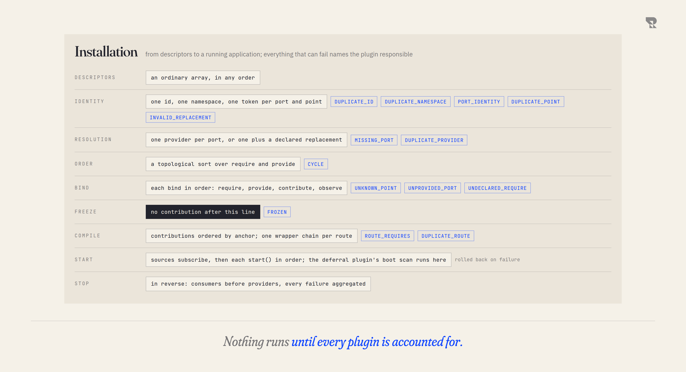

# Anatomy

Routecraft is a kernel and a set of plugins. This page names every part, says
which side of the line it sits on, and shows how a set of plugin descriptors
becomes a running application. The figure is the whole of it: every plugin,
ours and yours in the same rows; the six sockets they reach the kernel
through; the kernel, with what it does for one run, a park, a resume and a
sweep; and the ports it calls out through.

<picture>
  <source media="(prefers-color-scheme: dark)" srcset="figures/inside-the-harness-dark.png">
  
</picture>

## The kernel

The kernel owns five things and implements none of what plugs into them.

| The kernel owns | What that means |
|---|---|
| **Lifecycle** | bind every plugin in dependency order, freeze, compile routes, start, stop in reverse |
| **Resolution** | every port a plugin requires is resolved to exactly one provider before anything binds |
| **Ordering** | contributions land in the chain by the anchors they name, with the same sort that ordered the plugins |
| **Execution** | one exchange through a route: the rings, the wrappers, the step loop and its outcomes |
| **Continuation** | how a parked exchange is written, claimed, checked and resumed |

The kernel has no opinion about retries, storage, identity, agents or HTTP.
It cannot import a plugin: the module graph is checked against an allowlist
and a new file cannot sit outside it. **Demonstrated.**

The continuation protocol is the one honest exception to "the kernel knows
nothing". It is in the kernel because nothing else could own it: a plugin
that parks and a plugin that stores must agree on what a record means, and
that agreement is a contract, not a feature. You can replace where records
are kept and what parks an exchange; you cannot change the protocol that
resumes one.

## The contracts

Everything a plugin reaches the kernel through is one of five contracts. The
kernel defines them and implements none of them.

**Port.** A named, versioned capability: `port<ContinuationStore>("execution.continuations@2")`.
A plugin **requires** ports and **provides** ports; the kernel resolves each
required port to one provider at start and refuses to start otherwise. A plugin
never names another plugin, which is what lets a stranger replace a first-party
provider under their own name. The first-party ports today are atomic records,
agent sessions, continuations, authority, enforcement and resilience.

**Contribution.** Either a **handler** at a point, or a **wrapper** around the
route. A handler receives the exchange and returns a decision: allow (optionally
with a decorated exchange), refuse where the point honours refusal, or park
where the point honours parking. A wrapper receives the run and the next link
and surrounds it, the way retry or timeout does. Both name where they sit by
**anchors**: "after the retry anchor, before the timeout anchor", with each
anchor required or optional. Both declare **survival**: which kinds of run
they apply to.

**Step.** An instruction a route can execute. It receives the exchange and a
step context and returns one of six outcomes. Adapters and operations are
steps; a plugin exposes them to routes through a **family** of methods on the
route builder.

**Facet.** A typed, derived view of the exchange under the plugin's namespace:
`ex.auth`, `ex.deferral`. A facet is computed from the exchange's body and
headers each time it is read; it is never stored on its own, so nothing a
facet says can go stale across a park and a resume.

**Point.** A moment in an exchange's life at which handlers run. The kernel
declares four: **admission**, **entry**, **error** and **exit**. A plugin may
declare its own, and the declaration says which decisions the point honours,
so the compiler and the runtime enforce the same policy. Only the kernel's
error point honours parking, because only the executor knows where a park
would resume. **Intended:** the proof of concept's type lets a plugin-declared
point claim `defer: true` and then discards the decision at the call site; the
public type will restrict parking to the error point.

**Execution.** Not a contract you implement but a set of verbs every plugin is
handed in `bind`: `deliver`, `resume`, `sweep` and `errorChannel`. It is how
the deferral plugin's timer drives the sweep and how an ingress hands an
approval to a parked exchange. It is a socket in the same sense as the other
five, with the same reach for ours and yours, which is why the door (see
[Waiting and resuming](04-waiting-and-resuming.md)) is the only thing that
stands between a plugin holding a continuation id and its resume.

The four sockets on the [first page](01-what-changes.md) are the four you
build with. A point is a moment you declare, and execution is a set of verbs
you call; the figure below draws all six, because all six reach the kernel.

## Where the five things you build land

| You build | It is | You deliver it as |
|---|---|---|
| An adapter (a source or destination) | a step | a method in your plugin's family, such as `.from(yours)` or `.to(yours)` |
| An operation | a step | a method in your family, such as `.dedupe()` |
| A layer around every route | a wrapper contribution | contributed in `bind`, placed by anchor |
| Code at a moment in an exchange's life | a handler contribution | contributed in `bind`, at a kernel point or one you declared |
| Something the runtime needs | a port you provide | provided in `bind`, and named in `provides` |

## Namespaces

Every plugin owns exactly one namespace, by default the last segment of its
id (`acme.approvals` owns `approvals`). Everything the plugin names lives
under it: its facet is `ex.approvals`, its route options are
`approvals.something`, its events are `approvals:something`, and what its
handlers record on a continuation is keyed by it. Two plugins cannot collide
on a string.

Some of that the compiler tells you: a method or a facet of a plugin that is
not installed does not exist to call. The rest you learn when the application
is constructed, by name: two plugins claiming one namespace, an option key
under a namespace nobody installed, a handler at a point nobody declared, a
facet not named after its owner. Handler point names and route method names
are shared vocabulary rather than owner-qualified, which is why both are
checked for collision rather than silently merged. **Demonstrated.**

## Installation

<picture>
  <source media="(prefers-color-scheme: dark)" srcset="figures/installation-dark.png">
  
</picture>

An application is an ordinary array of plugin descriptors, in any order.
Everything that can go wrong on the way to running names the plugin
responsible and refuses before any traffic runs.

1. **Identity.** One id per plugin, one namespace per plugin, one token per
   port name. Two copies of a contract module in one process is the classic
   silent failure of plugin systems; here it is a named fault.
2. **Resolution.** Every required port is resolved to one provider. Two
   undeclared providers of one port is a fault that names both. A provider
   that declares it **replaces** a port may be installed alone or alongside
   the default, and is the one selected either way.
3. **Order.** A topological sort over what plugins require and provide. A
   cycle is a fault whose detail is the edges.
4. **Bind.** Each plugin's `bind` runs in that order, and this is where it
   requires, provides, contributes and observes. `requires` on the
   descriptor declares a port; `c.require(port)` in `bind` fetches the
   provider resolved for it, and refuses a port the descriptor did not
   declare. Its DSL family, its facets
   and the points it declares are static declarations on the descriptor, read
   before anything binds; `bind` is for what needs a live context.
5. **Freeze.** After the last `bind`, no contribution is accepted. A
   contribution arriving from `start` would silently miss an already composed
   chain, so it is refused instead.
6. **Compile.** Contributions are ordered by anchor with the same sort that
   ordered the plugins. Routes compile; wrapper state binds once per route, so
   a concurrency limit is a property of the route rather than of one
   delivery. A route that asks for something only a plugin can give names that
   plugin's port as a requirement, and refuses to compile without it.
7. **Start.** Sources subscribe, then each plugin's `start` runs in order. The
   deferral plugin's boot scan runs here. A failure rolls back what was
   acquired.
8. **Stop.** In reverse: consumers before providers, every failure
   aggregated, nothing skipped.

`application.runtime.dump()` shows the phase, the plugin order, which plugin
provides each port and whether it is a replacement, and every contribution in
its effective order. **Demonstrated.**

## Inside

The figure at the top of this page shows the parts working together. Five
things it says that the pages around it only imply:

- **The error ring sits outside the wrappers.** A failure the retry wrapper
  absorbs never reaches it; the ring hears only what escapes the whole
  chain. A handler that wants to park a transient failure for a human
  therefore sees it after the retries are spent, not before.
- **The door is the admission ring.** On a resume the kernel runs admission
  over the arriving approval, with a view of the record that leaves out its
  body, before it discloses or claims anything. The door is whatever the
  installed admission handlers decide; ours is the `auth` plugin's gate.
- **The kernel owns the sweep; the deferral plugin owns its cadence.**
  Claiming a due record, telling its route through the error channel and
  settling it are kernel code behind `execution.sweep()`. The deferral plugin
  decides when to call it, provides the store, and sets the default deadline.
- **Every record transition goes through one port.** The kernel never touches
  storage; it calls `CONTINUATIONS`, which ours provides over `RECORDS`. In
  the figure your store can replace the records store underneath, and
  nothing above it changes.
- **Anchors belong to a port.** `RETRY` and `TIMEOUT` are part of the
  resilience contract, so a replacement for our resilience plugin keeps them
  and every wrapper placed against them still lands where it did.

**Demonstrated:** the first two by probes D3 and D5 in
`validation/direction-docs-review/`, the fourth by D7, the third and fifth by
the proof of concept's `Runtime.sweep` and `Host.ordered`
(`ANCHOR_OWNER`).

## Replacing something we ship

Install your provider and declare that it replaces the port. Ours is the
default because it is installed by default, not because the kernel knows its
name; once yours is selected, our own plugins get yours, and never learn that
anything changed.

Two honest qualifications. First, a displaced default still binds and still
contributes: replacing our continuation store does not remove our deferral
plugin's route methods, its sweep, its default deadline or its dependency on
atomic records. If you want none of that, leave the default out and install
yours alone; if you want the methods and the sweep over your store, keep it
and let yours be selected. Both recipes are supported and both are tested.
**Demonstrated.** Second, who owns migrations, shutdown and the default
deadline when the provider changes is a **migration decision**, and the
provider recipe will say so explicitly before it is published.
