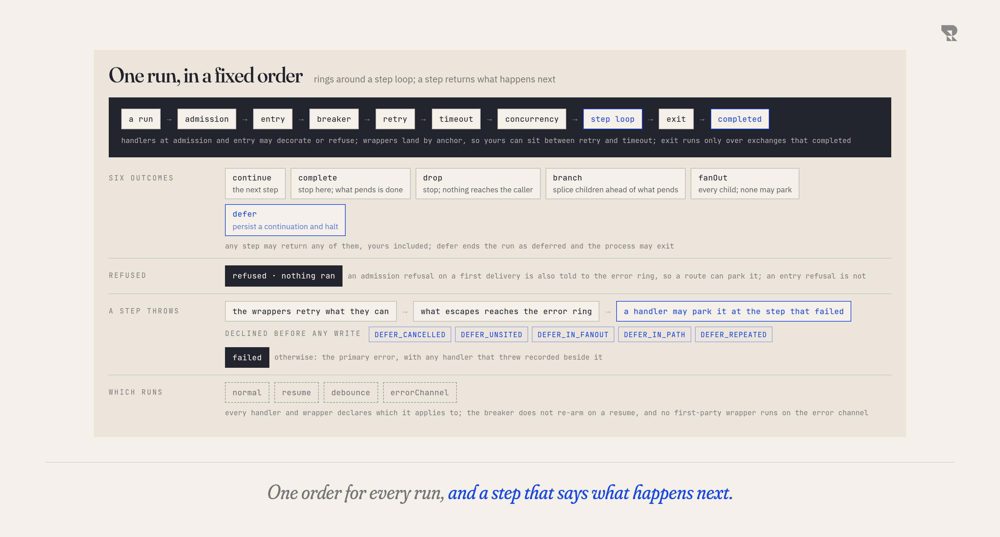

# One exchange through a route

A capability is a pipeline: a source produces something, operations do work
to it, a destination sends it somewhere. The thing travelling along the
arrows is an **exchange**: a body, some headers, and who the work is for.
This page is what happens around and inside that pipeline once an exchange
arrives.

<picture>
  <source media="(prefers-color-scheme: dark)" srcset="figures/exchange-path-dark.png">
  
</picture>

## Rings

Around every route sit rings of handlers, at points. Every handler at a point
runs, in the order the anchors put them in, and each one returns a decision.

| Point | When | A handler may |
|---|---|---|
| **admission** | before the route is entered, over the exchange as delivered | decorate, or refuse |
| **entry** | once admitted, before the first step | decorate, or refuse |
| **error** | when a step or a ring fails | decorate, or park the exchange |
| **exit** | when the path is done | decorate; what it adds is what the caller gets back |

Decoration composes: what one handler adds, the next one sees. A refusal
ends the run as **refused**, with nothing executed. A refusal at admission on
a first delivery is also told to the error ring, so a route can answer it (by
parking it, for instance); a refusal at entry is not. The exit ring runs only
over exchanges that completed: a run that dropped, parked, was refused or
failed has nothing to hand the caller, so exit never sees it. A handler that throws does not replace the failure it was handling:
the primary error is kept and the handler's fault is recorded beside it.

The authorization gate is an admission handler. The door of a resume is an
admission handler too, run over the arriving approval before anything about
the parked record is disclosed. That is the whole reason the rings exist as
contracts rather than as features: what we ship at these points, you can ship
at these points.

## Wrappers

Inside the rings, wrappers surround the route: breaker, retry, timeout,
concurrency, and anything you contribute. Each names the anchors it sits
between, so a stranger can land between retry and timeout without a change to
the kernel. The order is declared, not positional, and it is the same on every
route, which is why reading one route tells you how all of them behave.

When you call `.retry()` on a route you are not inserting a step into your
pipeline; you are configuring a wrapper that already surrounds it. The error
ring sits outside the whole chain: a failure a retry absorbs is never heard
there, and one it gives up on is heard once. A retry or
timeout you put on one step wraps that step alone, in the order you wrote
them.

## The step loop

The pipeline itself is a loop: the next step runs, returns an outcome, and
the loop acts on it. Six outcomes, not a `void` return, which is what makes
halting, branching and parking expressible by a plugin rather than only by
the framework.

| Outcome | What the loop does |
|---|---|
| `continue` | hands the exchange to the next step |
| `complete` | stops here; what pends is done; the exit ring runs |
| `drop` | stops here; nothing reaches the caller and the exit ring does not run |
| `branch` | splices the chosen children ahead of what pends |
| `fanOut` | schedules every child; siblings pend; no child may park |
| `defer` | persists a continuation at this step and halts the run as **deferred** |

So the introductory picture, in which every operation hands one exchange
onward, has four named exceptions. A filter drops. A choice branches. A split
fans out. A wait parks. Each is an outcome a step returns, and a step you
write can return any of them.

A step also receives a context: the run's cancellation signal, a way to
dispatch to another route, a way to invoke a plugin-declared point over the
exchange, and, on a resume, the state the parking step saved for itself.

## Failures

When a step throws, the error ring hears it. Every error handler runs; a
handler that declared it may answer by **parking** the exchange at the step
that failed, so a transient failure or a missing approval becomes a request
to a human instead of an error. The kernel declines a park before anything is
written when reviving it could not be right:

| Declined as | Because |
|---|---|
| `DEFER_CANCELLED` | the caller cancelled the run |
| `DEFER_UNSITED` | the failure belongs to no step, so reviving it would re-run steps that completed |
| `DEFER_IN_FANOUT` | nothing could revive one child of a fan-out alone |
| `DEFER_IN_PATH` | the failure is inside a nested path another step is running |
| `DEFER_REPEATED` | the same plugin's refusal was already parked once on this exchange, so a second park would loop |

**Demonstrated**, each with a test and a mutation. Otherwise the run ends as
**failed**, with the primary error and any secondary handler faults.

A refusal at admission that an error handler parks is stored as admission
received the exchange, not as the refusing handler saw it: when it resumes,
the whole admission ring runs again over the parked exchange, so storing the
decorated one would decorate it twice. **Demonstrated.**

## Run kinds

Not every delivery is a first delivery. A run is one of four kinds:
**normal**, **resume** (a continuation carrying on), **debounce** (a coalesced
release) and **errorChannel** (a route being told about a failure that
happened outside a run, such as an expiry). Every handler and every wrapper
declares which kinds it survives, rather than inheriting a default, because
getting this wrong has security consequences. A retry applies on a resume; a
breaker does not re-arm on one; the authorization gate applies on a first
delivery and at the door of a resume, and not on the error channel, where the
only identity is the recorded one and nothing is asking to execute.

## Events

The kernel emits what only it can see: `exchange:started` when a run begins
and one terminal event per run named after how it ended (`exchange:completed`,
`exchange:dropped`, `exchange:refused`, `exchange:deferred`,
`exchange:failed`), plus `path:failed` for a nested path,
`continuation:unrecorded` for a winner that never recorded its outcome and
`drain:abandoned` for a stop that timed out. A plugin emits under its own
namespace (`deferral:boot`, `deferral:sweep:failed`) and observes everything
through `observe` in `bind`. **Intended:** a typed payload per event and one
owner per terminal event. The proof of concept emits the deferred event twice
for an ordinary park, once by continuation id when the record is written and
once by exchange id when the run ends, and emits no `exchange:refused` at all:
a refused run returns before the terminal event. The published contract will
have exactly one terminal event per run.
