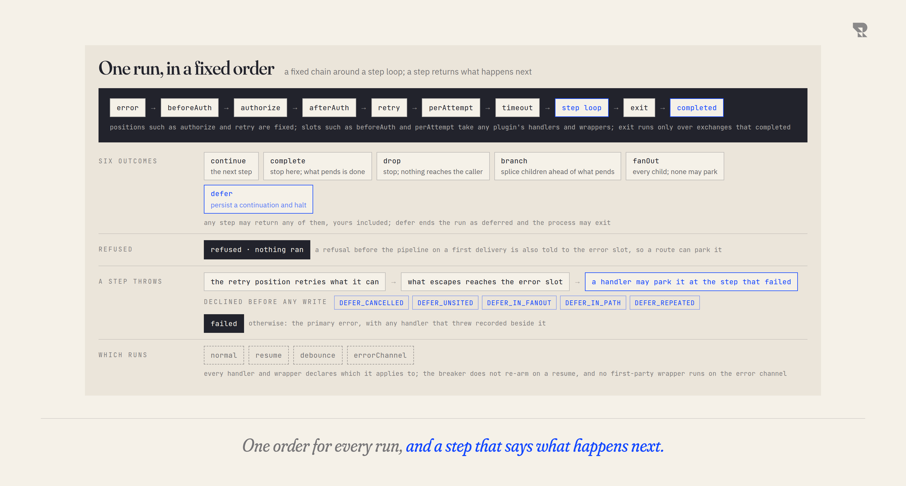

# One exchange through a route

A capability is a pipeline: a source produces something, operations do work
to it, a destination sends it somewhere. The thing travelling along the
arrows is an **exchange**: a body, some headers, and who the work is for.
This page is what happens around and inside that pipeline once an exchange
arrives.

<picture>
  <source media="(prefers-color-scheme: dark)" srcset="figures/exchange-path-dark.png">
  
</picture>

## The chain

Around every route sits one chain, and its order is fixed by the framework.
It is made of two kinds of place.

- **A position** belongs to the framework and holds exactly one thing:
  authorize, retry, timeout, the cache. A plugin can **replace** what fills
  a position, through that position's port: your own rate limiter in
  `throttle`, your own gate in `authorize`. It cannot move a position, remove
  one, or add a new one.
- **A slot** is a named place between positions where any plugin can add
  handlers or wrappers. Many plugins can share one slot.

<picture>
  <source media="(prefers-color-scheme: dark)" srcset="figures/chain-and-slots-dark.png">
  
</picture>

| In order | Kind | What happens there |
|---|---|---|
| `error` | slot | outermost: hears every failure that escapes the chain, and may park it |
| `beforeAuth` | slot | handlers over the exchange as delivered |
| `authorize` | position | the gate, filled by the auth plugin |
| `afterAuth` | slot | handlers that need the principal |
| `parse`, `input` | positions | the body is parsed and validated |
| `admitted` | slot | handlers over an admitted, valid exchange |
| `throttle`, `circuitBreaker`, `retry` | positions | resilience, filled by the resilience plugin |
| `perAttempt` | slot | wrappers that run inside every retry attempt |
| `timeout`, `concurrency`, `cacheCheck` | positions | per attempt |
| the pipeline | | your steps |
| `cacheStore` | position | |
| `exit` | slot | handlers over a completed exchange; what they add reaches the caller |

The slot names are the proposal; the exact list is settled against the shipped
chain when it is migrated. The mechanism below is decided.

## Order inside a slot

A plugin names a slot and a **phase**, and nothing else. It never names
another plugin, because it cannot know which other plugins will be installed.
The phase says what the handler does, and that decides when it runs:

| Phase | A handler there may | Does order inside the phase matter? |
|---|---|---|
| `observe` | read only: tracing, logging, metrics | No. None of them changes anything. |
| `mutate` | add or change headers and body | Yes, and only here. |
| `validate` | allow or refuse | Barely. All of them see the same final exchange; order only decides whose refusal you get. |

A slot runs its `observe` handlers, then its `mutate` handlers, then its
`validate` handlers. `exit` has no `validate` phase, because nothing can be
refused after the work is done. The framework enforces the phase when a route
compiles: an `observe` handler that returns a changed exchange is a fault, and
so is a `validate` handler that changes one.

Inside one phase, handlers run in the order the plugins are listed in the
application. Each one receives the exchange as the previous one left it, the
way middleware does: **allow** passes it on, **refuse** stops the chain and
nothing after it runs.

```ts
const tracing     = definePlugin({ id: "tracing",     hooks: { beforeAuth: { phase: "observe",  run: startSpan } } });
const tenancy     = definePlugin({ id: "tenancy",     hooks: { beforeAuth: { phase: "mutate",   writes: ["x-tenant"], run: setTenantFromHost } } });
const correlation = definePlugin({ id: "correlation", hooks: { beforeAuth: { phase: "mutate",   run: addCorrelationId } } });
const security    = definePlugin({ id: "security",    hooks: { beforeAuth: { phase: "validate", run: blockBadIps } } });

application({ plugins: [security, tenancy, correlation, tracing, auth] });
// beforeAuth runs: tracing (observe), tenancy then correlation (mutate, in list order),
// security (validate), then the authorize position.
```

When two handlers in the same phase write the same field, the later one wins,
the way a later CSS rule does, and the framework warns with both names. A
handler that declares the fields it `writes` moves that warning from the first
request that hits the conflict to the moment the application starts:

```
WARN at start: beforeAuth/mutate: tenancy and legacy both write x-tenant; legacy wins (listed later)
```

The person who installed both plugins is the one who can see the conflict, so
they settle it in the application, by the order of the list or explicitly:

```ts
application({
  plugins: [security, tenancy, legacy, tracing, auth],
  hooks: {
    order: { "beforeAuth/mutate": ["legacy", "tenancy"] },  // this phase of this slot runs in exactly this order
    disable: ["legacy/setTenantFromPath"],                   // or switch one handler off
  },
});
```

`disable` works on slots only. A position cannot be switched off; it can only
be replaced, so the gate is never silently removed. The dump prints every
route's resolved chain, slot by slot and phase by phase, with anything disabled
marked.

**Intended.** This is the model decided after the docs review. The proof of
concept places contributions by named anchors instead (`after` retry,
`before` timeout); the implementation replaces that with the positions,
slots and phases above, and phase enforcement and the `writes` check are
not yet demonstrated.

### Refusals, failures and the gate

A refusal ends the run as **refused**, with nothing executed. A refusal before
the pipeline on a first delivery is also told to the `error` slot, so a route
can answer it, by parking it for instance. The `exit` slot runs only over
exchanges that completed: a run that dropped, parked, was refused or failed
has nothing to hand the caller, so exit never sees it. A handler that throws
does not replace the failure it was handling: the primary error is kept and
the handler's fault is recorded beside it.

The authorization gate fills the `authorize` position. The door of a resume
runs the chain up to and including `afterAuth` over the arriving approval,
before anything about the parked record is disclosed. That is the reason the
chain is a contract rather than a feature: what we ship in these places, you
can ship in these places.

### Wrappers

A wrapper surrounds what comes after it, the way retry and timeout do.
Wrappers you contribute go in a wrapper slot such as `perAttempt`, where they
nest in plugin list order: the first one listed is the outermost.

When you call `.retry()` on a route you are not inserting a step into your
pipeline; you are configuring the `retry` position that already surrounds it.
The `error` slot sits outside the whole chain: a failure a retry absorbs is
never heard there, and one it gives up on is heard once. A retry or timeout
you put on one step wraps that step alone, in the order you wrote them.

## The step loop

The pipeline itself is a loop: the next step runs, returns an outcome, and
the loop acts on it. Six outcomes, not a `void` return, which is what makes
halting, branching and parking expressible by a plugin rather than only by
the framework.

| Outcome | What the loop does |
|---|---|
| `continue` | hands the exchange to the next step |
| `complete` | stops here; what pends is done; the `exit` slot runs |
| `drop` | stops here; nothing reaches the caller and the `exit` slot does not run |
| `branch` | splices the chosen children ahead of what pends |
| `fanOut` | schedules every child; siblings pend; no child may park |
| `defer` | persists a continuation at this step and halts the run as **deferred** |

So the introductory picture, in which every operation hands one exchange
onward, has four named exceptions. A filter drops. A choice branches. A split
fans out. A wait parks. Each is an outcome a step returns, and a step you
write can return any of them.

A step also receives a context: the run's cancellation signal, a way to
dispatch to another route, a way to invoke a plugin-declared point over the
exchange, and, on a resume, the state the parking step saved for itself.

## Failures

When a step throws, the `error` slot hears it. Every error handler runs; a
handler that declared it may answer by **parking** the exchange at the step
that failed, so a transient failure or a missing approval becomes a request
to a human instead of an error. The kernel declines a park before anything is
written when reviving it could not be right:

| Declined as | Because |
|---|---|
| `DEFER_CANCELLED` | the caller cancelled the run |
| `DEFER_UNSITED` | the failure belongs to no step, so reviving it would re-run steps that completed |
| `DEFER_IN_FANOUT` | nothing could revive one child of a fan-out alone |
| `DEFER_IN_PATH` | the failure is inside a nested path another step is running |
| `DEFER_REPEATED` | the same plugin's refusal was already parked once on this exchange, so a second park would loop |

**Demonstrated**, each with a test and a mutation. Otherwise the run ends as
**failed**, with the primary error and any secondary handler faults.

A refusal at the front of the chain that an error handler parks is stored as
the chain received the exchange, not as the refusing handler saw it: when it resumes,
the front of the chain runs again over the parked exchange, so storing the
decorated one would decorate it twice. **Demonstrated.**

## Run kinds

Not every delivery is a first delivery. A run is one of four kinds:
**normal**, **resume** (a continuation carrying on), **debounce** (a coalesced
release) and **errorChannel** (a route being told about a failure that
happened outside a run, such as an expiry). Every handler and every wrapper
declares which kinds it survives, rather than inheriting a default, because
getting this wrong has security consequences. A retry applies on a resume; a
breaker does not re-arm on one; the authorization gate applies on a first
delivery and at the door of a resume, and not on the error channel, where the
only identity is the recorded one and nothing is asking to execute.

## Events

The kernel emits what only it can see: `exchange:started` when a run begins
and one terminal event per run named after how it ended (`exchange:completed`,
`exchange:dropped`, `exchange:refused`, `exchange:deferred`,
`exchange:failed`), plus `path:failed` for a nested path,
`continuation:unrecorded` for a winner that never recorded its outcome and
`drain:abandoned` for a stop that timed out. A plugin emits under its own
namespace (`deferral:boot`, `deferral:sweep:failed`) and observes everything
through `observe` in `bind`. **Intended:** a typed payload per event and one
owner per terminal event. The proof of concept emits the deferred event twice
for an ordinary park, once by continuation id when the record is written and
once by exchange id when the run ends, and emits no `exchange:refused` at all:
a refused run returns before the terminal event. The published contract will
have exactly one terminal event per run.
