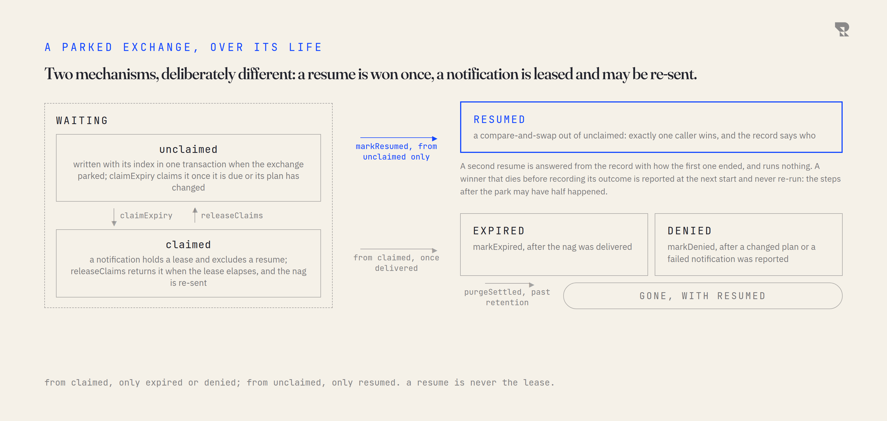
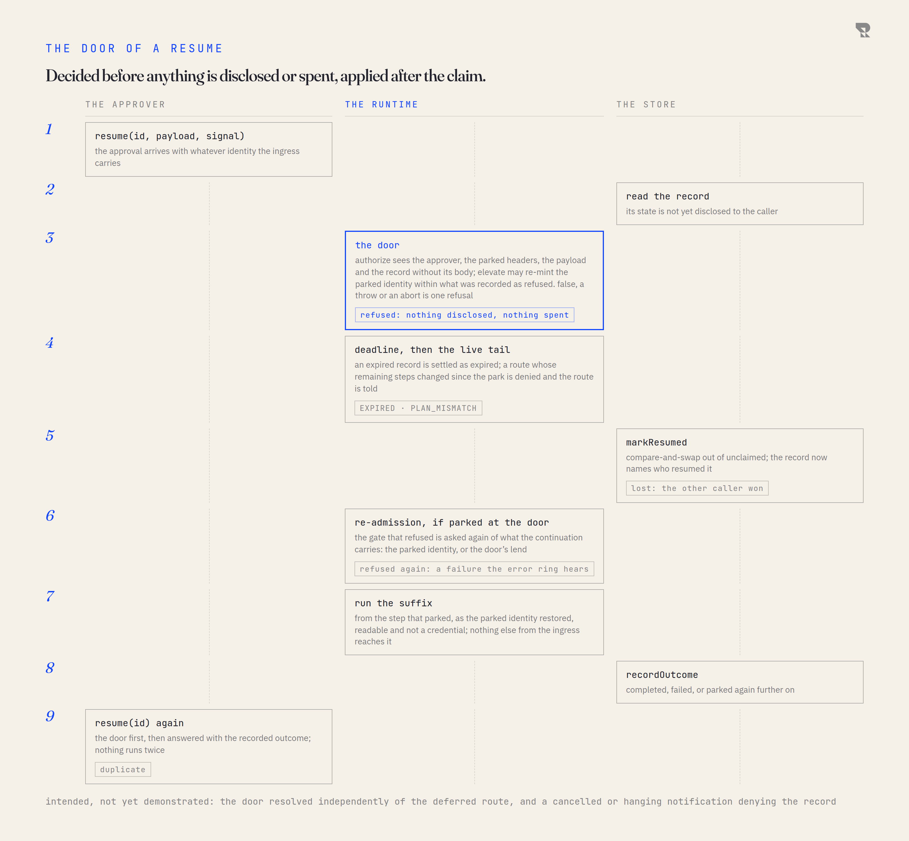

# Waiting and resuming

An exchange can stop in the middle of its route and wait: for an approval,
for a reply, for a human. Between stopping and carrying on the process can be
redeployed, restarted or killed. This page is how that works, what is
guaranteed, and what is deliberately not.

## Parking

A step parks an exchange by returning the `defer` outcome with a request: a
name, a reason, and optionally a deadline, a notification, policy inputs for
the door, and state the step wants back when it resumes. `.defer("approval")`
is the operation that returns it; an error handler that declared `mayDefer`
can return the same outcome from the error ring, which is how a failure
becomes a request to a human. The kernel then:

1. Computes the **site** (the step the continuation resumes at), the
   **frames** (which lists of steps still pend, and from where) and the
   **tail hash** (a fingerprint of the steps that remain, so an edited route
   is refused rather than run wrong).
2. Encodes the exchange with the persistence codec: plain JSON, dates in an
   envelope, and a refusal for anything that could not come back the same
   (functions, symbols, bigints, non-finite numbers, cycles, class instances,
   secrets a plugin marked). What is refused is a named fault at the park,
   never a surprise at the resume.
3. Writes the record and its waiting index in one transaction.
4. Calls the request's **notify** with the continuation id, after the record
   is durable and before the deferred event fires, so nobody is handed an id
   for a park that never committed. A notification that throws denies the
   record on the spot: a link nobody received cannot be resumed.
   **Demonstrated** for a throw. **Intended:** a notification that hangs or
   is cancelled denies the record too, and a run cancelled during the write
   settles the record after the write rather than leaving a live park. The
   shipped framework checks after the write, and its parked branch bounds
   the notification; the proof of concept checks only before the write.
5. Ends the run as **deferred**. The process may now exit.

Every park gets the store's default deadline unless the request names one;
a plugin installed with `ttl: null` opts a context out. **Demonstrated.**

## The record

| Field | What it is |
|---|---|
| `routeId`, `site`, `frames`, `tail` | where to resume, and the fingerprint of what will run |
| `exchange` | the body and headers as parked, encoded |
| `parkedAt`, `expiresAt` | when, and until when |
| `stepState` | what the parking step asked to get back, opaque to everyone else |
| `refusal` | what was refused when the park was raised at the door, keyed by the refusing plugin's namespace |
| `meta` | policy inputs the defer site attached for the door; the kernel never reads it |
| `state`, `outcome`, `by` | waiting, resumed, expired or denied; how it ended; who resumed it |

The record's `codec` version travels with it; a record from an older codec is
refused non-destructively rather than misread.

## The store

The kernel talks to a **continuation store** through a port, and the store is
whatever plugin provides it. Ours keeps records in SQLite over an atomic
record port that is itself a plugin; yours can be Postgres, or anything with
the same semantics. The contract is a set of transitions, and every one of
them is atomic with respect to the others:

<picture>
  <source media="(prefers-color-scheme: dark)" srcset="figures/continuation-states-dark.png">
  
</picture>

Two mechanisms, deliberately different. A **resume** is a compare-and-swap out
of waiting-and-unclaimed: exactly one caller wins, the record says who, and a
second resume is answered from the record with how the first one ended. A
**notification** (an expiry, a denial) is a lease: the record is claimed,
stays waiting, excludes a resume while the claim holds, and a holder that
dies mid-delivery is healed when the lease elapses and the nag is re-sent.
Re-sending a nag is safe. Re-running half a continuation is not, which is
why a resume is never the lease.

**Intended:** the claim returns the record it claimed. The proof of concept
reads the record before the door and claims it after, so state replaced in
between (a step re-saving what it wants back) is stored but not what the
winner runs. The published contract makes the claim the linearization point.

## The door

Who may carry a parked exchange on is decided when the approval arrives,
from the identity that arrives with it, before the record's state is
disclosed and before its claim is spent.

<picture>
  <source media="(prefers-color-scheme: dark)" srcset="figures/resume-door-dark.png">
  
</picture>

A route declares its door:

```ts
craft()
  .id('approvals')
  .from(mail('INBOX'))
  .authenticate(mailPrincipal)
  .resumable({
    authorize: ({ principal }) => mayApprove(principal),
    elevate: ({ principal, record }) => lendRefusedScopes(principal, record),
  })
```

**`authorize`** sees the approver, the parked headers, the raw payload and the
record without its body, and answers whether this approver may resume this
record. Without it, the door asks the route's own grants of the approver. A
route that declares no grants and no `.resumable()` has no door policy at
all: any holder of the continuation id, an installed plugin included, can
resume it. **Demonstrated** (probe D5). That is the shipped bearer default;
whether 0.8 fails closed instead is a **migration decision**. A
`false`, a throw and an abort are one refusal, "the door refused the
resumer", bounded by the approval's own cancellation signal, so a hook that
consults a slow directory cannot hold the door open past a stop.
**Demonstrated.**

**`elevate`** may re-mint the parked identity for this one resume: the same
subject, the same permanent grants, and lent grants drawn only from what the
gate recorded as refused when the park was raised. The lend belongs to the
resume that made it and is never stored. **Demonstrated**, with one gap:
the proof of concept compares grant sets by joined text, so a grant name
containing a comma can slip a widening past the check. **Intended:** a
structural comparison.

The door runs before the record's state is disclosed and before the claim.
A refused approver learns nothing about the record and spends nothing: the
record stays waiting for its rightful holder. **Demonstrated.** The door also
runs before a duplicate is answered, so a second approver is refused before
learning the first one succeeded. **Intended:** the door resolved
independently of the deferred route. Today the door's policy is read from
the route that parked, so a deployment without that route cannot apply it
and answers with an unknown-route fault instead; the published contract
fails closed (refuse, disclose nothing) and lets an ingress route carry its
own door, as the shipped framework does.

## The resume, after the door

1. The **deadline**: an overdue record is settled as expired, and the route
   is told through its error channel.
2. The **live tail**: the remaining steps of the route as compiled now are
   hashed and compared with the record's; a route whose tail changed since
   the park is denied, and told. An edited approval flow does not run the
   wrong steps.
3. The **claim**: `markResumed`, compare-and-swap, recording who resumed.
4. **Re-admission**, if the park was raised at the door: the admission ring
   runs again over what the continuation carries now, the restored identity
   or the door's lend. Without a lend, the identity that was refused is
   refused again, audibly, and the record ends failed; a second park for the
   same refusal is declined. **Demonstrated.**
5. The **suffix** runs from the site, as the parked identity restored,
   readable and not a credential. The approval's payload reaches it as a
   header, and the door's lend as headers the door carried; nothing else
   from the approval does.
6. The **outcome** is recorded: completed, failed, or parked again further
   on. A second resume is answered with it and runs nothing. **Intended:**
   a decoding failure after the claim is recorded as a failed outcome; the
   proof of concept records nothing for it, which reads as a crash.

**Intended:** a stop that times out while a resume is between its claim and
its first step fences the run, so nothing executes on disposed resources.
The proof of concept re-checks acceptance after the door and not after the
claim.

## Expiry and the sweep

The deferral plugin sweeps on an interval: it releases elapsed claims, purges
settled records past retention, and pages through records that are due. Each
due record is claimed, its route is told through the error channel (so a
capability can react to an approval nobody gave), and the record is settled
as expired. A record whose route this deployment lacks is counted and left
alone. The sweep checks between pages and between records whether the
application is stopping, yields between pages, and detects a scan that stops
advancing. **Demonstrated.**

At start, the plugin runs one sweep and reports records that were resumed and
never recorded an outcome: continuations a previous process died inside.
They are reported, never re-run.

## What is not promised

- **Exactly-once effects.** A step that sends an email and then the process
  dies may have sent it. On resume the suffix runs from the site, not from
  the step's own last effect. Effects a step performs through `commit` are
  fenced against a cancelled run; effects it performs any other way are the
  step's own.
- **Effects after a crash.** A winner that dies between the claim and its
  first effect produced no effect, and is reported rather than re-driven. A
  notification, by contrast, is re-sent when its lease elapses. The two are
  different because re-sending a nag is safe and re-running a payment is
  not.
- **A single transaction across stores.** The continuation store and any
  other store a plugin keeps are not one transaction.
- **Retracting IO.** A timeout cancels the run's signal; a plugin that
  ignores the signal is not interrupted.
- **A resume of a changed route.** It is refused, not migrated.

Defaults: a deadline of 72 hours, a notification lease of 60 minutes, a
sweep every 60 seconds, retention of 90 days. All four are options on the
deferral plugin.
