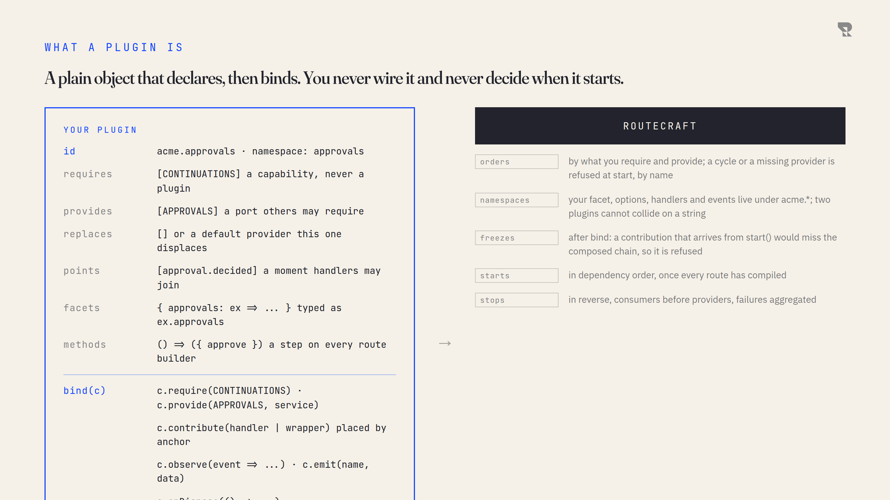

# Writing a plugin

A plugin is a plain object. It declares what it needs and what it offers,
binds what needs a live context, and starts and stops when the kernel says
so. You never wire it up and you never decide when it starts.

<picture>
  <source media="(prefers-color-scheme: dark)" srcset="figures/plugin-declares-dark.png">
  
</picture>

## The descriptor

| Field | What it declares | When it is read |
|---|---|---|
| `id` | your identity, `acme.approvals`; the last segment is your namespace unless you set one | before anything binds |
| `requires` | the ports you consume | resolution, before binding |
| `provides` | the ports you offer | resolution |
| `replaces` | a port whose default provider yours displaces | resolution |
| `points` | moments you declare, with the decisions each honours | before binding |
| `facets` | `{ approvals: (ex) => ... }`, your typed view of the exchange | static declaration |
| `methods` | your family: the methods your plugin adds to the route builder | static declaration |
| `bind(c)` | require, provide, contribute, observe, emit, onDispose | in dependency order |
| `start(c)` / `stop(c)` | acquire and release what needs a running application | after every route compiled; in reverse at stop |

The static half (facets, methods, points) is assembly: the compiler needs it
to type a route before any application exists. The dynamic half (bind, start,
stop) is resource binding. Keep them apart: a descriptor is reusable across
applications, so anything mutable, a timer, a connection, a cache, belongs
in `bind` or `start`, never in the closure that built the descriptor.
**Intended:** the proof of concept's own deferral plugin keeps its sweep
timer in the descriptor closure, so two applications built from one exported
value share it; the published plugin will not.

## A complete third-party plugin

The one below is abridged from a real one: the external consumer the proof of concept
builds against a packed tarball of the framework, with no workspace aliases,
in `validation/round-two/external.fixture.ts`. It contributes a route method,
declares a handler point, contributes a handler at it and a wrapper in the
chain, exposes a facet, brings its own source, and is installed beside a
replacement for our store. `bun run verify:packed` runs it. The abridgement drops the type
parameters on `methods`, the source, and the assertions, and names the
package the contracts will ship in rather than the spike.

```ts
// A moment this plugin declares. The symbol is the point's identity: another
// plugin cannot redeclare the same name with a different one.
const CUSTOM: unique symbol = Symbol("outside point");
declare module "@routecraft/routecraft" {
  interface HandlerPoints {
    "acme:inspect": { readonly owner: typeof CUSTOM; readonly refuse: true; readonly defer: false };
  }
}

// The family: what `.choose()` means on a route builder once this plugin is installed.
type Choose<B, P extends readonly Plugin[], H extends object> = {
  choose(this: Cursor<B, P, H, "after">): Chain<B, P, H, "after">;
};
interface ChooseFamily extends Family {
  readonly methods: Choose<this["Body"], this["Plugins"], this["Headers"]>;
}

const stranger: Plugin<ChooseFamily, { stranger: () => { label: string } }> = {
  id: "acme.stranger",
  facets: { stranger: () => ({ label: "outside" }) },
  methods(cursor) {
    const child = instruction("acme.stranger", "external-child", async (ex, ctx) => {
      const decorated = await ctx.invoke("acme:inspect", ex);
      return { kind: "continue", exchange: decorated ?? ex };
    });
    return {
      choose: () =>
        cursor.step("external-branch", (ex) => ({ kind: "branch", exchange: ex, steps: [child] }), [child]),
    };
  },
  points: [point("acme:inspect", CUSTOM, true, false)],
  bind(ctx) {
    ctx.contribute({
      kind: "handler", id: "external-point", point: "acme:inspect", survival: allRuns,
      handle: (ex) => ({ kind: "allow", exchange: ex }),
    });
    ctx.contribute({
      kind: "wrapper", id: "audit", survival: allRuns,
      after: [{ anchor: RETRY, presence: "required" }],
      before: [{ anchor: TIMEOUT, presence: "required" }],
      bind: () => async (next, run) => next(run),
    });
  },
};

const app = application([operations, resilience, stranger, deferral, sqlite(":memory:", "acme.store", true)]);
const spec = app
  .route<{ correlation: string }>("outside")
  .retry(2)
  .from(source)
  .choose()
  .transform((body, ex) => body + (ex.stranger.label === "outside" ? 1 : 0))
  .defer("hold")
  .build();
```

Three things to notice. `.choose()` and `ex.stranger` are typed because the
plugin is in the array; in an application built without it, both are compile
errors. The wrapper names the anchors it sits between and does not know or
care what else is in the chain. And the store beside it is a replacement for
ours, selected by declaration, which the plugin never learns about.

## What you get for free

- **Ordering.** You require ports; the kernel finds an order or names the
  cycle.
- **Namespacing.** Your facet, options, events and recorded decisions live
  under your namespace, and a collision is a fault at start, not a silent
  overwrite.
- **Failure attribution.** Anything that fails on the way to running names
  your plugin, by code.
- **Reverse teardown.** Your `stop` runs after everything that depends on
  you has stopped, and every disposer you registered runs even when another
  one throws.
- **Diagnostics.** `runtime.dump()` shows where your contributions landed and
  which provider each port resolved to.

## Effort, honestly

A plugin that only wants to add a step needs an id, a family with one method,
and nothing else: no ports, no points, no lifecycle. A plugin that only wants
to observe needs an id and a `bind` that calls `observe`. The full descriptor
above is the ceiling, not the floor. **Intended:** helpers for the common
shapes (a plugin that is one operation, a plugin that is one provider), so an
ordinary side effect does not copy the family machinery; the low-level
protocol stays available underneath.

## Packaging

A contract is a token: a port is a symbol, a point is a symbol. Two copies of
the contract module in one process are two different tokens, and the kernel
refuses that at start by name rather than resolving nothing. So the package
that defines a port is a **peer** of every package that uses it, and your
package declares it as one. **Migration decision:** the non-TypeScript
contract (point names, anchor names, namespaces, option keys, event names and
payloads, fault codes, the record codec, the hash projection) is versioned
and published as such before any plugin outside this repository is asked to
depend on it.
