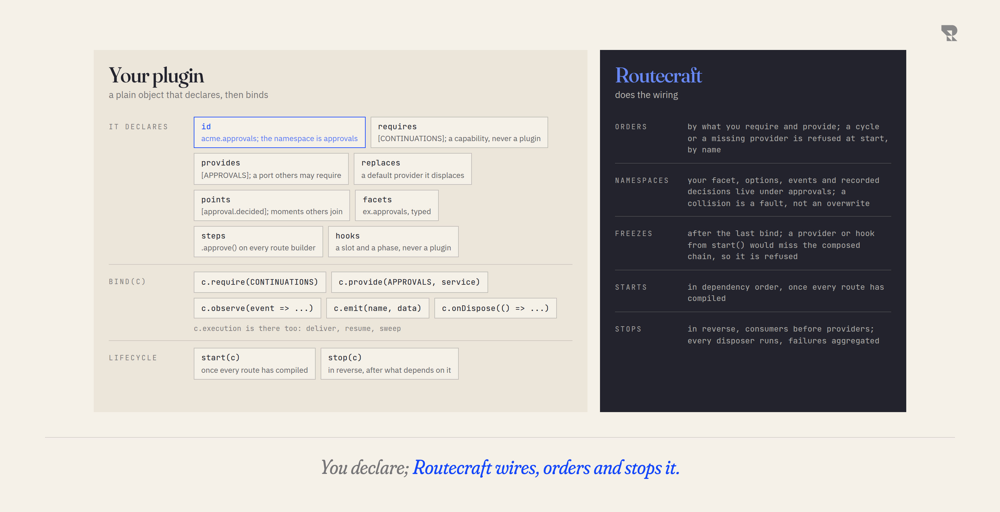

# Writing a plugin

A plugin is a plain object. It declares what it needs and what it offers,
binds what needs a live context, and starts and stops when the kernel says
so. You never wire it up and you never decide when it starts.

<picture>
  <source media="(prefers-color-scheme: dark)" srcset="figures/plugin-declares-dark.png">
  
</picture>

## The descriptor

| Field | What it declares | When it is read |
|---|---|---|
| `id` | your identity, `acme.approvals`; the last segment is your namespace unless you set one | before anything binds |
| `requires` | the ports you consume | resolution, before binding |
| `provides` | the ports you offer | resolution |
| `replaces` | a port whose default provider yours displaces | resolution |
| `points` | moments you declare, with the decisions each honours | before binding |
| `facets` | `{ approvals: (ex) => ... }`, your typed view of the exchange | static declaration |
| `steps` | the step types your plugin adds; each key becomes a method on the route builder | static declaration |
| `hooks` | handlers and wrappers in the chain's slots, each with a phase | static declaration, placed when routes compile |
| `bind(c)` | require, provide, observe, emit, onDispose | in dependency order |
| `start(c)` / `stop(c)` | acquire and release what needs a running application | after every route compiled; in reverse at stop |

The static half (facets, steps, hooks, points) is assembly: the compiler needs it
to type a route before any application exists. The dynamic half (bind, start,
stop) is resource binding. Keep them apart: a descriptor is reusable across
applications, so anything mutable, a timer, a connection, a cache, belongs
in `bind` or `start`, never in the closure that built the descriptor.
**Intended:** the proof of concept's own deferral plugin keeps its sweep
timer in the descriptor closure, so two applications built from one exported
value share it; the published plugin will not.

## A complete third-party plugin

This is the target API. A plugin adds a step type that can park an exchange,
a facet, a handler in the chain and a wrapper, and it provides a port of its
own.

```ts
// packages/acme-approvals/src/index.ts
import { definePlugin, step, port, CONTINUATIONS } from "@routecraft/routecraft";

export const APPROVALS = port<ApprovalService>("acme.approvals@1");

export const approvals = definePlugin({
  id: "acme.approvals",
  requires: [CONTINUATIONS],
  provides: [APPROVALS],

  // ex.approvals, typed, in every route of a project that installs this plugin.
  facets: {
    approvals: (ex) => ({ approvedBy: ex.headers["acme.approvedBy"] as string | undefined }),
  },

  // A new step type. Its key becomes the method: .approve() on the route builder.
  steps: {
    approve: (opts: { reason: string }) =>
      step<Invoice, Invoice>(async (ex, ctx) =>
        ctx.kind === "resume"
          ? { kind: "continue", exchange: ex }
          : { kind: "defer", exchange: ex, request: { name: "approval", reason: opts.reason } },
      ),
  },

  // Handlers and wrappers in the chain: a slot and a phase, never another plugin's name.
  hooks: {
    afterAuth: { phase: "validate", run: requireInvoiceNumber },
    perAttempt: { wrap: timeEachAttempt },
  },

  bind(c) {
    c.provide(APPROVALS, approvalService(c.require(CONTINUATIONS)));
  },
});
```

The project lists its plugins once, and that list types the route builder:

```ts
// craft.config.ts
export const { craft } = defineProject({
  plugins: [operations, resilience, deferral, sqlite, principals, auth, approvals],
});
```

The route author writes the same syntax as today:

```ts
// capabilities/invoices.ts
import { craft } from "../craft.config";

export default craft()
  .id("invoices")
  .retry(2)
  .from(mail("INBOX"))
  .approve({ reason: "over the limit" })
  .transform((invoice, ex) => ({ ...invoice, approvedBy: ex.approvals.approvedBy }))
  .to(erp());
```

Three things to notice. `.approve()` and `ex.approvals` exist because the
plugin is in the project; in a project without it, both are compile errors,
so a route cannot reach production calling a step that is not installed. The
step can park the exchange, which a `.transform()` cannot. And the hooks name
a slot and a phase, never another plugin, so this plugin works beside any
others without knowing them.

**Intended.** `definePlugin`, `defineProject` and `hooks` are the target API.
The proof of concept demonstrates the same mechanism with the lower-level
types they would generate (`Plugin<Family>` and `Cursor`), in the external
consumer it builds against a packed tarball of the framework
(`validation/round-two/external.fixture.ts`, run by `bun run verify:packed`).
A plugin author never writes those types. Their cost is guarded by a
type-performance budget in CI: ten plugins installed, a limit on `tsc` time,
and a check that the error for a wrong argument stays readable.

## What you get for free

- **Ordering.** You require ports; the kernel finds an order or names the
  cycle.
- **Namespacing.** Your facet, options, events and recorded decisions live
  under your namespace, and a collision is a fault at start, not a silent
  overwrite.
- **Failure attribution.** Anything that fails on the way to running names
  your plugin, by code.
- **Reverse teardown.** Your `stop` runs after everything that depends on
  you has stopped, and every disposer you registered runs even when another
  one throws.
- **Diagnostics.** `runtime.dump()` shows every route's resolved chain, slot by
  slot and phase by phase, and which provider each port resolved to.

## Effort, honestly

A plugin that only adds a step needs an id and one `steps` entry: no ports,
no points, no lifecycle. A plugin that only watches traffic needs an id and
one hook in the `observe` phase. The plugin above is the ceiling, not the
floor. `definePlugin` derives every type a route needs, so no author writes
the type machinery underneath it; the low-level protocol stays available for
the rare plugin that needs it.

## Packaging

A contract is a token: a port is a symbol, a point is a symbol. Two copies of
the contract module in one process are two different tokens, and the kernel
refuses that at start by name rather than resolving nothing. So the package
that defines a port is a **peer** of every package that uses it, and your
package declares it as one. **Migration decision:** the non-TypeScript
contract (point names, slot and phase names, namespaces, option keys, event names and
payloads, fault codes, the record codec, the hash projection) is versioned
and published as such before any plugin outside this repository is asked to
depend on it.
